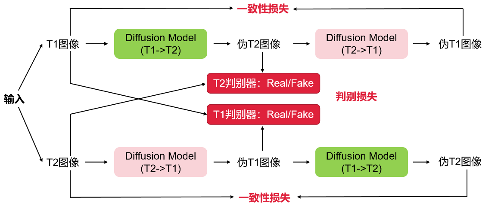

## 一、模型介绍
**1. Diffusion 模型在图像生成任务中相比 GAN 更具稳定性与生成质量。受 CycleGAN 启发，本项目将 Diffusion 引入 CycleGAN 框架，以提升其在图像转换任务中的性能** 
**2. 为验证模型的有效性，在磁共振成像（MRI）数据上开展实验，实现在无配对数据条件下从 T1 向 T2 的图像转换**

## 二、文件结构说明

### 训练文件目录

- train/train.py: 单卡训练代码入口
- train/train_multi_gpu.py: 分布式训练代码入口
- train/train_dist.sh: 分布式训练脚本
- train/custom/dataset/dataset.py: dataset类
- train/custom/model/discriminator.py: 判别器网络
- train/custom/model/generator.py: 生成器网络
- train/custom/model/model_loss.py: 损失函数
- train/custom/model/backbones/*.py 网络backbone
- train/custom/utils/*.py 训练相关工具函数
- train/config/model_config.py: 训练的配置文件

### 预测文件目录

* example/test_config.yaml: 预测配置文件
* example/main.py: 预测入口文件
* infer/predictor.py: 模型预测具体实现，包括加载模型和后处理

## 三、demo调用方法

1. 准备训练原始数据
   * 在train文件夹下新建train_data/origin_data文件夹，放入用于训练的原始dcm数据
   * 运行python custom/utils/generate_dataset.py，该命令将数据和标签打包成npy文件，作为网络dataset的输入，此步主要为减少训练时的io操作

2. 开始训练
   * 训练相关的参数，全部在train/custom/config/model_config.py 文件中
   * 分布式训练命令：sh ./train_dist.sh
   * 单卡训练命令：python train.py
   * 训练时，每隔指定epoch会输出训练过程中的损失变化情况，自动保存在train/Logs下。tf_logs/ 目录下存有训练的tensorboard日志文件，通过 tensorborad --logdir tf_logs/ --port=6003 进行查看。backup.tar文件为训练时自动备份的当前代码，供有需要时查看和复原，复原命令: python custom/utils/version_checkout.py

3. 准备测试数据
   * 将预测的dcm数据放入example/data/input目录

4. 开始预测
   * cd test
   * python main.py

5. 结果示例

   
